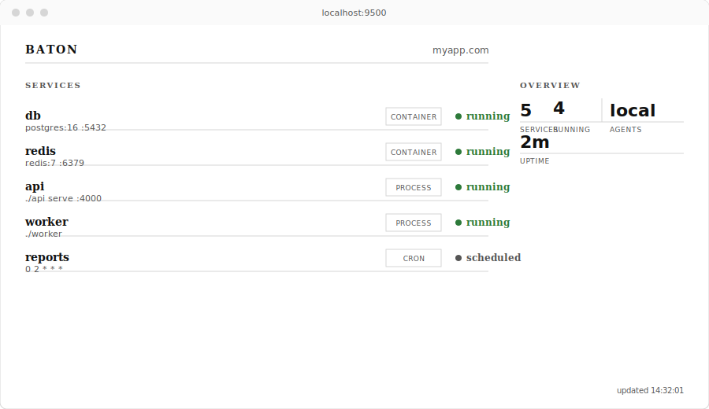

<p align="center">
  
</p>

<h3 align="center">Deploy apps, not infrastructure</h3>

<p align="center">
  Baton is a deployment tool for teams who need to ship services without the overhead of Kubernetes.
  <br>One config file. One binary. Zero YAML.
</p>

---

<p align="center">
  
</p>

## What it does

Baton reads a single `baton.toml` file and runs your entire stack: processes, containers, databases, workers, cron jobs. It handles dependency ordering, health checks, restarts, service discovery, and graceful shutdown.

```toml
[app]
name = "myapp"
domain = "myapp.com"

[[service]]
name = "db"
image = "postgres:16"
volume = "pg_data"

[[service]]
name = "api"
run = "./api serve"
port = 4000
health = "/health"
after = ["db"]

[[service]]
name = "worker"
run = "./api process-jobs"
after = ["db"]
```

```
$ baton up
starting myapp...

  [ok] db     postgres:16 on :5432
  [ok] api    ./api serve on :4000
  [ok] worker ./api process-jobs running

all services running. ctrl+c to stop.
```

## Install

```
cargo install baton
```

Or build from source:

```
git clone https://github.com/michaelmillar/baton.git
cd baton
cargo build --release
```

## Quick start

```
cd your-project
baton init        # detects your stack, generates baton.toml
baton up          # starts everything
```

`baton init` detects Rust, Go, Node.js, Elixir, and Dockerfile projects automatically.

### Adding services

```
baton add postgres              # adds postgres:16 with volume
baton add redis                 # adds redis:7
baton add worker --run "./app process-jobs"
baton add cron --name reports --run "./app report" --schedule "0 2 * * *"
baton add static                # adds static file serving from ./dist
baton add spa                   # same, with SPA routing
baton add process --name api --run "./api serve" --port 4000
```

Known service types: `postgres`, `redis`, `mysql`, `mariadb`, `mongo`, `rabbitmq`, `nats`, `worker`, `cron`, `static`, `spa`, `process`.

### Validating config

```
baton validate                   # checks baton.toml for errors
```

### Environment variables

Baton loads `.env` files automatically. Variables are injected into all services.

```
# .env
SECRET_KEY=my-secret
API_TOKEN="bearer abc123"
DATABASE_URL=postgres://custom@host/db
```

## Config reference

### App

```toml
[app]
name = "myapp"
domain = "myapp.com"
```

### Services

Each `[[service]]` block defines one thing to run. A service must have one of `run`, `build`, `image`, or `static`.

| Field | Type | Purpose |
|-------|------|---------|
| `name` | string | Unique service name |
| `run` | string | Shell command to execute |
| `image` | string | Container image to pull and run |
| `build` | string | Path to build context (Dockerfile) |
| `static` | string | Path to static files to serve |
| `port` | int | Port the service listens on |
| `health` | string | HTTP health check path |
| `after` | list | Services that must start first |
| `volume` | string | Named volume for persistent data |
| `schedule` | string | Cron expression for scheduled tasks |
| `replicas` | int or map | Number of instances |
| `runtime` | string | Runtime hint (e.g. "beam" for Elixir clustering) |
| `cluster` | bool | Enable runtime-specific clustering |
| `team` | string | Team ownership label |
| `spa` | bool | Enable SPA routing for static sites |

### Environments

```toml
[environments.staging]
domain = "staging.myapp.com"
nodes = ["s1", "s2"]

[environments.prod]
domain = "myapp.com"
nodes = ["p1", "p2", "p3", "p4"]
```

### Per-environment replicas

```toml
[[service]]
name = "api"
run = "./api serve"
replicas = { staging = 1, prod = 3 }
```

## Service discovery

Baton injects environment variables so services can find each other:

| Service type | Variables injected |
|---|---|
| Any service with a port | `{NAME}_HOST`, `{NAME}_PORT` |
| Postgres | `DATABASE_URL` |
| Redis | `REDIS_URL` |
| MySQL/MariaDB | `DATABASE_URL` |
| MongoDB | `MONGO_URL` |

## Dashboard

```
baton up --ui                     # starts services + web dashboard on :9500
baton up --ui --ui-port 8080      # custom port
baton server --port 9090          # server mode includes dashboard at /
```

The dashboard shows live service status, types, ports, and cluster overview. It updates every 2 seconds with no dependencies or build step.

## Architecture

Baton is a single binary with three modes:

```
baton up                           # local dev, runs everything on this machine
baton server --port 9090           # control plane, accepts configs, schedules services
baton agent --server host:9090     # node agent, runs on each server
```

For local development, `baton up` is all you need. For production across multiple servers, run `baton server` somewhere and `baton agent` on each node.

The server exposes a JSON API for cluster management:

```
GET  /api/status              # cluster state, agents, assignments
POST /api/agents/register     # agent self-registration
POST /api/agents/heartbeat    # agent health reporting
POST /api/deploy              # trigger service scheduling
```

## Chaos engineering

Baton has built-in chaos testing. No extra tools needed.

```
baton up --chaos                              # kill random services every 30s
baton up --chaos --chaos-interval 10          # every 10 seconds
baton up --chaos --chaos-probability 0.5      # 50% chance each interval
baton up --chaos --chaos-target api           # only target the api service
```

Services with restart policies will automatically recover. Use chaos mode to verify your app handles failures gracefully before they happen in production.

## Examples

See the [examples](examples/) directory:

- [simple-api](examples/simple-api/) - API with Postgres, Redis, worker, and scheduled reports
- [static-site](examples/static-site/) - SPA with static file serving
- [multi-service](examples/multi-service/) - Multiple services across teams with environments

## Status

Baton is in early development. Working today:

- [x] TOML config parsing and validation
- [x] Project auto-detection (`baton init`)
- [x] Process management with restart and backoff
- [x] Container management (Docker/Podman)
- [x] Dependency ordering (topological sort)
- [x] Service discovery via env vars
- [x] Graceful shutdown
- [x] Static file serving with SPA support
- [x] Cron scheduling
- [x] `baton add` scaffolding (12 service types)
- [x] Chaos engineering (`--chaos` flag)
- [x] HTTP health checks (actual endpoint verification)
- [x] `.env` file support
- [x] Docker build support (`build = "."`)
- [x] Reverse proxy with domain routing
- [x] Config validation (`baton validate`)
- [x] Server mode with JSON API
- [x] Agent mode with registration and heartbeat
- [x] Service scheduling (round-robin across agents)
- [x] Web dashboard (`--ui` flag, also built into server mode)
- [x] 69 tests (unit, integration, stress)
- [ ] TLS via Let's Encrypt
- [ ] Rolling deployments

## Licence

MIT
